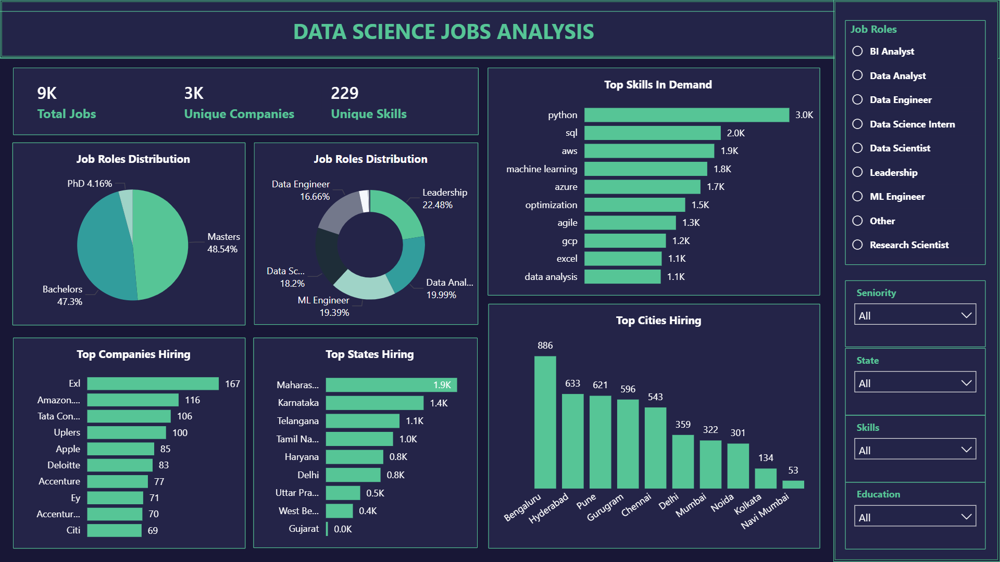

# 📊 **Data Science Jobs Market Analysis (2025)**

### *Python • Excel • Power BI • Data Modeling • Web Scraping*

## 🚀 Executive Summary

This project analyzes **9,000+ Data Science job postings across India** collected from platforms like LinkedIn and Indeed using a custom Python-based web scraper. The goal was to understand **what skills, locations, industries, and job roles dominate the Indian job market**, and what qualifications employers expect in 2025.

Using **Python, Excel Pivot Tables, Power Query, and Power BI**, the dataset was cleaned, transformed, modeled, and visualized into a **single-page interactive dashboard** that provides valuable insights for job seekers, career changers, and workforce planners.

### 📌 Key Highlights

* **Total Jobs:** 9K+
* **Unique Companies Hiring:** 3K+
* **Unique Skills Identified:** 229
* **Top Skills:** Communication, Python, SQL, AWS, Leadership
* **Top Cities Hiring:** Bengaluru, Hyderabad, Pune
* **Top Industries Hiring:** Technology, Consulting, Finance
* **Most Required Education:** Masters & Bachelors
* **Experience Expectation:** 3–7 years for most roles

---

# 🧩 Business Problem

The Data Science job landscape evolves quickly — new tools emerge, cloud skills are demanded, and hiring hotspots shift. Candidates often struggle with:

* Which skills should I learn first?
* What cities/states have the most job opportunities?
* What job roles dominate the Indian market?
* What experience and education do companies expect?
* Which industries hire the most Data professionals?

### ❓ **Guiding Question:**

**“What does the Data Science job market in India look like in 2025, and how can job seekers align themselves with market demand?”**

---

# 🖼️ Dashboard Preview



---

# 🔍 Methodology

## 1️⃣ **Data Scraping (Python)**

A custom scraper (`job_scraper.py`) was developed using the **JobSpy Docker API** to extract thousands of job postings.

### Extracted fields included:

* Job title
* Company
* Description
* City & State
* Skills
* Education & Experience requirements
* Seniority & job type
* Posted date
* Industry mapping

Raw output stored as:

```
data/jobs_raw.csv
```

---

## 2️⃣ **Data Cleaning & EDA (Jupyter Notebook)**

Performed in `EDA.ipynb`:

✔ Removed duplicates
✔ Standardized job titles, cities, states
✔ Extracted skills from text
✔ Created skill list by splitting/unpivoting
✔ Cleaned education & experience columns
✔ Derived new fields (role category, skill count, etc.)

Exported cleaned dataset:

```
data/jobs_cleaned.csv
```

---

# 3️⃣ **Excel Analysis (Pivot Tables)**

Before building the Power BI dashboard, **Excel Pivot Tables** were used for validation, exploration, and generating dimension tables.

### ✔ Pivots Created

| Pivot Table                | Purpose                                  |
| -------------------------- | ---------------------------------------- |
| **Top States Hiring**      | Count jobs per state                     |
| **Top Cities Hiring**      | Identify major hiring hotspots           |
| **Top Companies**          | Companies with the highest hiring volume |
| **Top Skills**             | Skill frequency across all postings      |
| **Job Roles Distribution** | Count of Data Analyst, ML Engineer, etc. |
| **Education Requirement**  | Masters vs Bachelors vs PhD              |
| **Experience Required**    | 0–12 years distribution                  |

### ✔ Why Excel?

* Quick exploratory analysis
* Fast validation before BI modeling
* Easy export of Top 10 datasets
* Served as **dimension tables** in Power BI

All pivot tables were saved inside:

```
ds-jobs-analysis.xlsx
```

---

# 4️⃣ **Data Modeling (Power BI)**

A clean **star schema** was designed with:

### 📌 Fact Table

* `jobs` (1 row per job posting)

### 📌 Dimension Tables

* `skills`
* `jobs_skills` (bridge table for many-to-many relationships)
* `companies`
* `cities`
* `state`
* `job_roles`
* `education`
* `experience`
* `industries`
* Top 10 tables (from Excel pivots)

### 🔗 Relationships Include:

* `jobs` 1️⃣—🅱️ `jobs_skills`
* `skills` 1️⃣—🅱️ `jobs_skills`
* `jobs` 1️⃣—🅱️ `companies`, `cities`, `state`, `education`, `experience`

The model supports dynamic slicing across all filters.

---

## 🗺️ Power BI Dashboard Highlights

- **Choropleth Map of India** — states shaded by job counts.  
- **Top In-Demand Skills** — visualized through bar charts.  
- **Top Hiring Companies** — insights into key employers.  
- **Top Cities for Data Science Jobs** — location-based insights.

---

## 📘 Learning Outcomes

- ETL pipeline design and automation  
- Cloud database integration (TiDB SQL Cloud)  
- Building REST APIs with FastAPI  
- Full-stack data visualization (React + Power BI)  
- Structuring real-world portfolio projects  

---

## 🔮 Future Improvements

- Add filters for job type, experience, and salary range.  
- Deploy on a public cloud (e.g., Render/Netlify + TiDB Cloud).  
- Integrate authentication for user dashboards.  
- Automate data refresh using scheduled scripts.

---

## 👨‍💻 Author

**Alok Deep**  
Data Analyst | Data Enthusiast | Full-Stack Data Projects  
📧 [Add your email or portfolio link here]  
🌐 [Add your LinkedIn / GitHub link here]

---

### ⭐ If you find this project useful, please star the repo!
````
